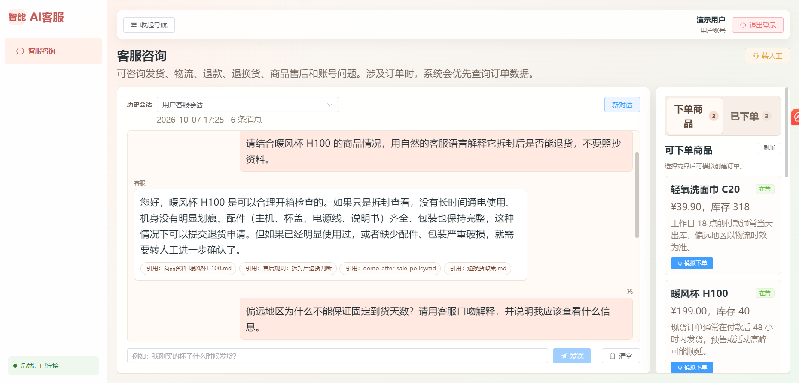
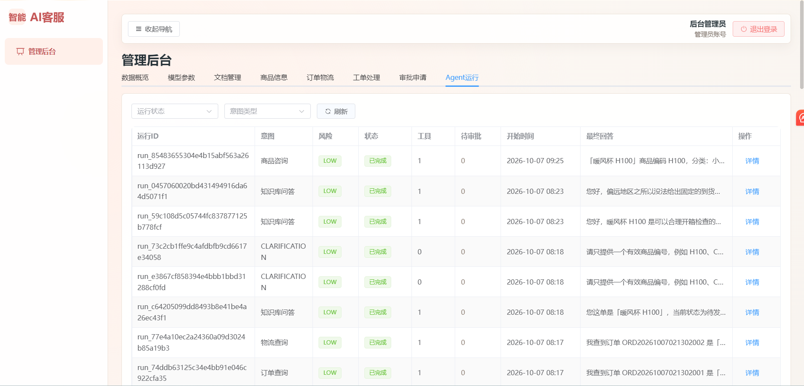

# Smart Support System

智能客服是一个面向电商售后场景的企业知识库客服与人工工单协同平台。当前主版本定位为 **基于受控 LLM Workflow 的电商售后智能处置与人工协同平台**。它不是多 Agent 系统，也不允许大模型自由执行高风险操作；核心链路采用确定性业务工作流 + 受控 LLM 节点 + 三路混合检索 + Tool Use + Human-in-the-loop 审批。


## 核心功能

- 用户端客服聊天：支持商品咨询、订单查询、物流查询、退款/退货/破损售后咨询。
- 商品与订单模拟：内置演示商品、下单、订单状态和物流信息。
- 后台管理端：商品、订单、物流、工单、知识库文档、模型参数、Agent 运行轨迹。
- 真实后端登录：用户端和管理端分角色登录。
- 高风险动作审批：退款、取消订单不会由模型直接改库，必须进入管理员审批。
- Agent 审计：记录每次 Agent 运行、执行步骤、工具调用、审批动作和检索轨迹。

## 部分功能展示




## 受控 LLM Workflow 与可靠性边界

当前链路不是“让大模型自由决定并直接改库”，而是：

```text
输入安全检查
→ 上下文补全
→ LLM/规则结构化规划
→ 策略二次校验
→ 统一工具执行器 / RAG / 审批申请
→ 基于证据的回答生成
→ 输出安全检查
→ 审计收口
```

LLM 只用于结构化规划候选和基于证据的回答生成。身份权限、订单归属、订单状态机、退款/取消前置条件、幂等控制、管理员审批、库存回补、数据库写入和审计记录都由确定性代码控制。

## 技术栈

后端：

- Python 3.12
- FastAPI
- SQLAlchemy 2.x Async ORM
- Alembic
- MySQL
- Redis
- Qdrant
- PyJWT
- LangGraph 响应安全守卫图

前端：

- Vue 3
- TypeScript
- Vite
- Element Plus
- Axios

## 目录结构

```text
smart-customer-service/
├── server/                 # 当前 Python FastAPI 后端
│   ├── app/                # 后端业务代码
│   ├── alembic/            # 数据库迁移
│   ├── scripts/            # 演示数据和验证脚本
│   └── tests/              # 后端测试
├── web/                    # Vue 前端
├── deploy/                 # Docker Compose、Nginx、部署脚本
├── docs/                   # 项目说明文档
└── .env.example            # 本地配置模板，不包含真实 API Key
```

## 本地启动

### 1. 准备环境

需要安装：

- Python 3.12.x
- Node.js 18+
- Docker Desktop

不建议使用 Python 3.14 作为本项目运行环境。

### 2. 安装后端依赖

```powershell
cd server
py -3.12 -m venv .venv
.\.venv\Scripts\python.exe -m pip install -e ".[dev]"
```

### 3. 启动基础服务

```powershell
cd ..
docker compose -f deploy/docker-compose.yml up -d mysql redis qdrant
```

### 4. 初始化数据库、演示数据与知识库

```powershell
cd server
.\.venv\Scripts\python.exe scripts\bootstrap_local.py
```

该脚本依次完成：建表（Alembic）→ 演示业务数据 → 扫描 `sample-data/knowledge/` 并走 Web 上传同一条链路入库（切块 + embedding + Qdrant）。可重复执行，内容未变的文件会报 `UNCHANGED` 并跳过。

### 5. 启动后端

推荐使用根目录的启动脚本（先加载根目录 `.env`，再以项目 venv 启动 uvicorn）：

```powershell
.\deploy\run-server-local.ps1
```

加 `-Init` 可先执行第 4 步再启动。也可手动启动——`app/core/config.py` 已改用 `pydantic-settings`，会自动读取根目录 `.env`：

```powershell
cd server
.\.venv\Scripts\python.exe -m uvicorn app.main:app --host 127.0.0.1 --port 18080
```

### 6. 启动前端

```powershell
cd web
npm ci
npm run dev
```

访问地址：

- 前端：`http://127.0.0.1:5173`
- 后端健康检查：`http://127.0.0.1:18080/api/v1/health`

## 演示账号

```text
用户端：
账号：user
密码：123456

管理端：
账号：admin
密码：admin123
```

若有问题欢迎沟通(#^.^#)
