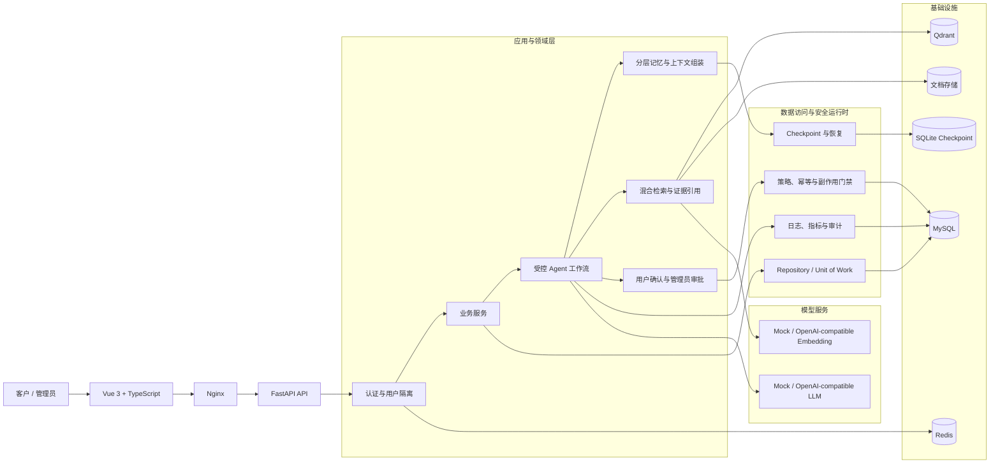
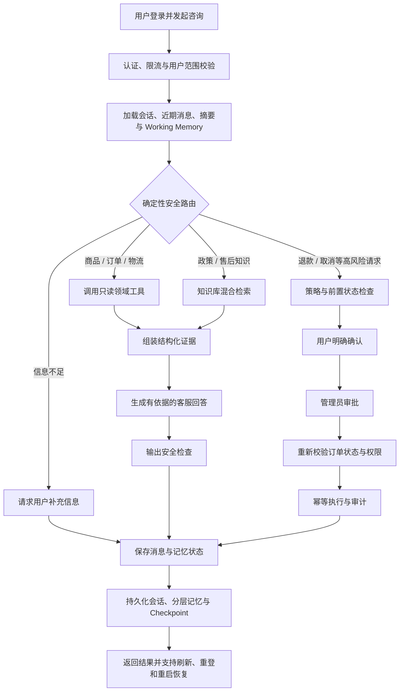

# 智能客服 Agent

智能客服 Agent 是一个面向电商售后场景的智能客服与人工协同平台。系统以确定性业务规则为边界，将商品、订单、物流和知识库查询与受控 LLM 工作流结合，在提供自然语言客服体验的同时，确保退款、取消订单等高风险操作必须经过身份校验、用户确认、管理员审批、状态复核与审计。

项目采用 Python FastAPI、Vue 3、MySQL、Redis、Qdrant 和 Docker Compose 构建，默认可在 Mock LLM 与 Mock Embedding 模式下完整演示，也支持接入 OpenAI-compatible 模型服务。

## 核心功能

- **智能客服**：支持商品、库存、订单、物流、退款、退货、换货、破损售后与账号问题咨询。
- **知识库问答**：上传并解析知识文档，完成文本切块、Embedding、向量检索、关键词检索与来源引用。
- **受控 Agent 工作流**：由规则路由、结构化规划、工具执行、证据组装和输出守卫组成，模型不能直接操作数据库。
- **分层记忆**：组合当前问题、近期消息、滚动摘要和 Working Memory，并通过持久化 Checkpoint 支持中断恢复。
- **跨登录会话恢复**：聊天记录按用户隔离保存，支持刷新页面、退出重登和进程重启后的会话恢复。
- **人工协同**：退款、取消订单等请求进入用户确认和管理员审批流程，不会因普通咨询直接产生业务写入。
- **安全与可靠性**：包含越权防护、提示注入防护、敏感信息保护、幂等执行、状态复核、副作用门禁和审计记录。
- **运营管理**：管理端提供商品、订单、物流、工单、知识文档、模型配置、审批申请和 Agent 运行记录查看能力。
- **可替换模型**：LLM 与 Embedding 均提供 Mock 实现和兼容接口实现，便于离线演示与真实模型联调。

### 部分功能展示

| 用户端客服 | 管理端 Agent 运行记录 |
| --- | --- |
|  |  |

## 项目架构图



## 核心业务流程图



## 项目目录结构

```text
DianshangAgent/
├── server/
│   ├── app/
│   │   ├── agent/          # Agent 状态、路由、规划、状态图与工具注册
│   │   ├── api/            # FastAPI 路由、认证入口与响应封装
│   │   ├── core/           # 配置、安全、异常与时区
│   │   ├── db/             # SQLAlchemy 会话与数据模型
│   │   ├── embeddings/     # Mock 与兼容接口的 Embedding 客户端
│   │   ├── llm/            # Mock 与 OpenAI-compatible LLM 客户端
│   │   ├── memory/         # 上下文组装、Working Memory 与滚动摘要
│   │   ├── observability/  # 日志、指标与敏感信息保护
│   │   ├── rag/            # 文档解析、切块与检索配置
│   │   ├── repositories/   # 数据访问、事务与用户范围隔离
│   │   ├── runtime/        # Checkpoint、锁、恢复和安全运行时
│   │   ├── schemas/        # API 请求、响应与 Agent 数据结构
│   │   ├── services/       # 业务规则与应用服务
│   │   └── workers/        # 知识文档后台处理任务
│   ├── alembic/            # MySQL 数据库迁移
│   ├── scripts/            # 初始化、示例数据与知识同步脚本
│   ├── tests/              # 功能、安全、持久化与恢复测试
│   ├── alembic.ini
│   └── pyproject.toml
├── web/
│   ├── src/
│   │   ├── views/          # 客服端和管理端页面
│   │   ├── api.ts          # 后端 API 封装
│   │   ├── auth.ts         # 前端认证状态
│   │   ├── router.ts       # 页面路由
│   │   └── App.vue         # 应用入口组件
│   ├── package.json
│   └── package-lock.json
├── deploy/                 # Docker Compose、Dockerfile 与 Nginx 配置
├── docs/                   # 项目不足与市场调研文档
├── sample-data/
│   └── knowledge/          # 可直接导入的示例知识库
├── .env.example            # 环境变量模板，不包含真实密钥
├── LICENSE
└── README.md
```

## 快速安装部署

### 1. 环境要求

- Docker Desktop 或 Docker Engine + Docker Compose
- 本地开发可选：Python 3.12、Node.js 18+
- 建议至少预留 4 GB 可用内存

### 2. 配置环境变量

在项目根目录复制配置模板：

```powershell
Copy-Item .env.example .env
```

macOS 或 Linux：

```bash
cp .env.example .env
```

打开 `.env`，至少修改 MySQL 密码、JWT 密钥和演示账号密码。`.env` 已被 Git 忽略，请勿提交真实密钥。

默认配置使用：

```dotenv
LLM_MOCK_ENABLED=true
EMBEDDING_MOCK_ENABLED=true
```

因此无需外部模型服务即可运行完整演示流程。

### 3. Docker Compose 一键启动

```powershell
docker compose --env-file .env -f deploy/docker-compose.yml up -d --build
docker compose --env-file .env -f deploy/docker-compose.yml ps
```

Compose 会依次启动 MySQL、Redis、Qdrant，执行 Alembic 迁移，写入演示商品和订单，导入 `sample-data/knowledge/`，然后启动后端、文档 Worker 与前端。

启动完成后访问：

- 前端：<http://127.0.0.1:18088>
- 后端 readiness：<http://127.0.0.1:18080/api/v1/readiness>
- Qdrant 控制台：<http://127.0.0.1:6333/dashboard>

演示账号由 `.env` 中的 `DEMO_CUSTOMER_*` 和 `DEMO_ADMIN_*` 配置决定。

停止服务并保留数据卷：

```powershell
docker compose --env-file .env -f deploy/docker-compose.yml down
```

除非确认不再需要本地数据，否则不要添加 `-v`。

### 4. 本地开发启动

先启动基础设施：

```powershell
docker compose --env-file .env -f deploy/docker-compose.yml up -d mysql redis qdrant
```

安装后端并初始化数据库、演示数据和知识库：

```powershell
cd server
py -3.12 -m venv .venv
.\.venv\Scripts\python.exe -m pip install -e ".[dev]"
.\.venv\Scripts\python.exe scripts\bootstrap_local.py
cd ..
```

启动后端：

```powershell
.\deploy\run-server-local.ps1
```

也可以在 `server/` 下直接运行：

```powershell
.\.venv\Scripts\python.exe -m uvicorn app.main:app --host 127.0.0.1 --port 18080
```

启动前端：

```powershell
cd web
npm ci
npm run dev
```

本地开发前端地址为 <http://127.0.0.1:5173>。

### 5. 接入真实模型

在 `.env` 中配置兼容接口，密钥只保存在本地：

```dotenv
LLM_MOCK_ENABLED=false
LLM_API_KEY=your_api_key
LLM_BASE_URL=https://your-provider.example/v1
LLM_MODEL_NAME=your_model
```

如需真实 Embedding，再单独设置 `EMBEDDING_MOCK_ENABLED=false` 及对应的 `EMBEDDING_*` 参数。修改后重建或重启 `server` 与 `document-worker`。

### 6. 构建与测试

后端：

```powershell
cd server
.\.venv\Scripts\python.exe -m compileall app
.\.venv\Scripts\ruff.exe check .
.\.venv\Scripts\mypy.exe app
.\.venv\Scripts\pytest.exe
```

前端：

```powershell
cd web
npm ci

若有问题欢迎沟通^-^！
npm run build
```

若服务未正常启动，优先检查 `.env`、端口占用以及以下状态：

```powershell
docker compose --env-file .env -f deploy/docker-compose.yml ps
docker compose --env-file .env -f deploy/docker-compose.yml logs server
```
